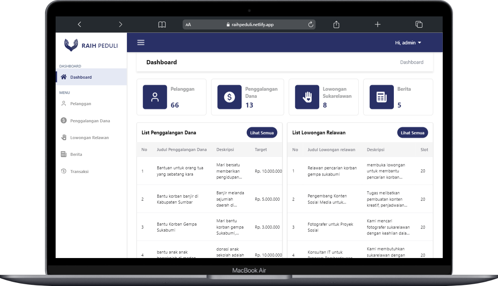

## <a href="https://github.com/Capstone-Alterra">Raih Peduli</a> Dashboard

## About the project

This project created for manage various aspects, including fundraising, volunteer vacancies, news related to environmental and social issues, transactions, and overall dashboard functionality.

## Features

- Landing page
- Manage customers
- Manage fundraisings
- Manage volunteer vacancies
- Manage volunteer registrants
- Manage news
- View transactions
- Export fundraising programs data from CSV or Spreadsheet file
- Get Content Recommendation Engines [AI]

## Built with

## Contributors

[][gilangdiwangkara]
[][gilangsetyawan]
[][irwanadinata]
[][johansyahdiaz]
[][maskharis]
[][najwan]
[][samil]
[][wildan]

[irwanadinata]: https://github.com/irwanadinata
[gilangsetyawan]: https://github.com/setyawan1234
[gilangdiwangkara]: https://github.com/ginov4110
[johansyahdiaz]: https://github.com/johansyahdiaz
[maskharis]: https://github.com/maskharisajah
[najwan]: https://github.com/NajwannurIman
[samil]: https://github.com/samilalghiffary
[wildan]: https://github.com/wildanibr

## Conclusion

This project is created to fulfill the requirements of the Kampus Merdeka Batch 5 capstone project at Alterra Academy.

Thank you for your attention to this repository!

#happycoding
